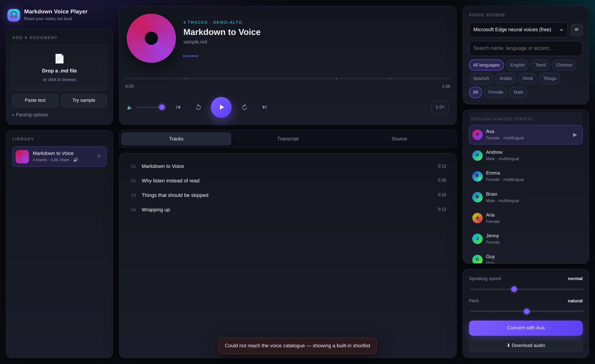

# 🎧 Markdown Voice Player

Drop in a `.md` file, pick a voice, and listen to it like an album — chapters
become tracks, headings become the playlist, and the text lights up word by
word as it's read.



## What it does

- **Upload a Markdown file** (or paste text) and it's split into tracks at your
  chosen heading level
- **300+ real neural voices**, free, no API key — English (US, UK, India,
  Australia, Ireland, Singapore, Nigeria…), Tamil, Hindi, Telugu, Malayalam,
  Kannada, Marathi, Gujarati, Bengali, plus ~90 other languages
- **Preview any voice** before committing to a full conversion
- **Speaking speed and pitch** control at generation time, plus instant
  playback speed (0.75× – 2×) while listening
- **Karaoke transcript** — every word is highlighted in time with the audio,
  and clicking a word jumps there
- **Code blocks and tables are skipped** with a short spoken note, so the
  audio stays listenable (toggleable)
- **Download the finished MP3** and put it on your phone

## Install

```bash
cd md-voice-player
python -m venv .venv && source .venv/bin/activate    # Windows: .venv\Scripts\activate
pip install -r requirements.txt
```

## Run

```bash
python run.py
```

Opens `http://127.0.0.1:8000` in your browser.

```bash
python run.py --port 9000        # different port
python run.py --host 0.0.0.0     # reachable from your phone on the same wifi
python run.py --no-browser       # don't auto-open a tab
python run.py --engine demo      # offline tone generator, no internet needed
```

## How it works

```
your.md ──▶ markdown_parser ──▶ chapters ──▶ TTS engine ──▶ chapter MP3s
                                                                  │
            player UI ◀── word timings + track offsets ◀── stitched audio.mp3
```

| File | Role |
|---|---|
| `mdvoice/markdown_parser.py` | Markdown → speakable chapters. Strips markup, drops code/tables, keeps link text. |
| `mdvoice/engines/edge.py` | Microsoft Edge neural voices via `edge-tts`. Returns audio **and** per-word timings. |
| `mdvoice/engines/demo.py` | Offline tone generator for testing the UI with no internet. |
| `mdvoice/library.py` | Document storage + the background synthesis job queue. |
| `mdvoice/server.py` | FastAPI routes. |
| `static/index.html` | The whole player UI — one self-contained file. |

Generated files live in `workspace/<document-id>/`. Delete that folder any time.

## Keyboard shortcuts

| Key | Action |
|---|---|
| `Space` | Play / pause |
| `←` / `→` | Back / forward 5s (hold `Shift` for 30s) |
| `J` / `L` | Previous / next track |

## Adding another voice engine

Engines are plug-in classes. To add ElevenLabs, OpenAI TTS, Piper or Coqui,
create `mdvoice/engines/yours.py`:

```python
from . import TTSEngine, Word, register

@register
class MyEngine(TTSEngine):
    name = "mine"
    label = "My engine"
    audio_format = "mp3"
    mime_type = "audio/mpeg"

    async def list_voices(self, refresh=False):
        return [{"id": "v1", "name": "Nova", "locale": "en-US",
                 "gender": "Female", "styles": [], "categories": []}]

    async def synthesize(self, text, voice, *, rate=0, pitch=0, volume=0):
        audio = ...              # bytes
        words = [Word("hello", 0.0, 0.4)]   # optional, powers the karaoke view
        return audio, words
```

Import it in `mdvoice/engines/__init__.py` (next to `edge` and `demo`) and it
shows up in the engine dropdown. Nothing else changes.

## Notes and limits

- Edge voices synthesise on Microsoft's servers, so you need an internet
  connection. Nothing is stored there; text is sent per chapter.
- Voice list is cached for a week in `workspace/.cache/`. The ⟳ button
  re-downloads it. If the download fails you get a built-in shortlist of ~115
  voices instead.
- Word timings come from the engine. If an engine doesn't provide them, the
  audio still works — only the karaoke highlight is skipped.
- Files are capped at 4 MB (`MDVOICE_MAX_UPLOAD` to change).

## Troubleshooting

**"Cannot connect to host speech.platform.bing.com"** — no internet, or a
firewall/proxy is blocking it. Try `python run.py --engine demo` to confirm the
rest of the app works.

**No sound on play** — some browsers block autoplay until you interact with the
page. Click play once more.

**Audio duration looks wrong** — install `mutagen` (it's in
`requirements.txt`); without it durations fall back to a rough estimate.

## Environment variables

| Variable | Default | Meaning |
|---|---|---|
| `MDVOICE_ENGINE` | `edge` | Which engine to start with |
| `MDVOICE_PORT` | `8000` | Port |
| `MDVOICE_HOST` | `127.0.0.1` | Bind address |
| `MDVOICE_WORKSPACE` | `./workspace` | Where documents and audio are stored |
| `MDVOICE_CONCURRENCY` | `3` | Chapters synthesised in parallel |
| `MDVOICE_MAX_UPLOAD` | `4194304` | Upload size limit in bytes |
